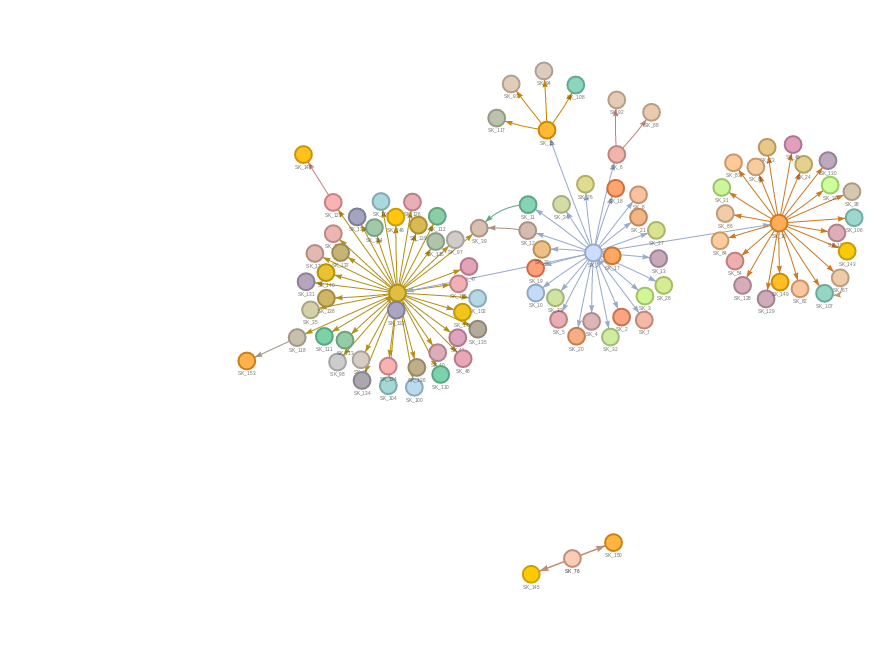
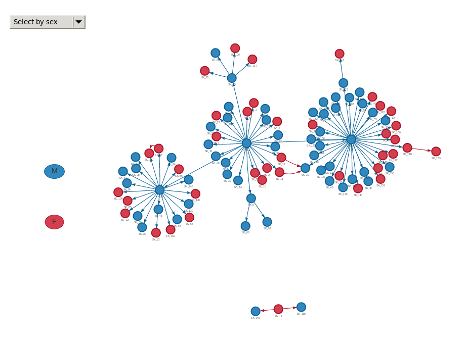
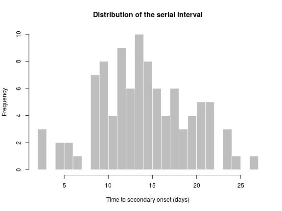

Welcome to the *epicontacts* package!
---------------------------------------

<br>

[](https://travis-ci.org/reconhub/epicontacts)
[](https://ci.appveyor.com/project/thibautjombart/epicontacts/branch/master)
[](https://codecov.io/github/reconhub/epicontacts?branch=master)
[](https://cran.r-project.org/package=epicontacts)
[](https://cran.r-project.org/package=epicontacts)


<br>

# Installing the package

To install the current stable, CRAN version of the package, type:

```r
install.packages("epicontacts")
```

To benefit from the latest features and bug fixes, install the development, *github* version of the package using:

```r
devtools::install_github("reconhub/epicontacts")
```

Note that this requires the package *devtools* installed.


# What does it do?

The main features of the package include:

* **`epicontacts`:** a new S3 class for storing linelists and contacts data

* **`make_epicontacts`:** a constructor for the new `epicontacts` class

* **`get_id`:** access unique IDs in an `epicontacts` with various options

* **`get_pairwise`**: extract attributes of record(s) in contacts database using
    information provided in the linelist data of an `epicontacts` object.

* **`get_degree`:** access degree of cases in `epicontacts` with various options

* **`x[i,j,contacts]`:** subset an `epicontacts` object by retaining specified
    cases

* **`thin`:** retains matching cases in linelist / contacts

* **`summary`:** summary for `epicontacts` objects

* **`plot`:** plot for `epicontacts` objects; various types of plot are
    available; default to `vis_epicontacts`

* **`vis_epicontacts`:** plot an `epicontacts` object using `visNetwork ` 

* **`as.igraph.epicontacts`:** create an `igraph` object from an epicontacts object

* **`get_clusters`:** assign clusters and corresponding cluster sizes to
    linelist of an epicontacts object (clusters being groups of connected
    individuals/nodes).

* **`subset_clusters_by_id`**: subset an `epicontacts` object based on a IDs of
    cases of interest.

* **`subset_clusters_by_size`**: subset an `epicontacts` object based on size(s)
    of clusters (clusters being groups of connected individuals/nodes).

* **`graph3D`**: 3D graph from an `epicontacts` object.


# Resources

## Vignettes

An overview of *epicontacts* is provided below in the worked example below.
More detailed tutorials are distributed as vignettes with the package:


```r
vignette("overview", package="epicontacts")
vignette("customize_plot", package="epicontacts")
vignette("epicontacts_class", package="epicontacts")
```


## Websites

The following websites are available:

- The official *epicontacts* website, providing an overview of the package's functionalities, up-to-date tutorials and documentation: <br>
[http://www.repidemicsconsortium.org/epicontacts/](http://www.repidemicsconsortium.org/epicontacts/)

- The *epicontacts* project on *github*, useful for developers, contributors, and users wanting to post issues, bug reports and feature requests: <br>
[http://github.com/reconhub/epicontacts](http://github.com/reconhub/epicontacts)

- The *epicontacts* page on CRAN: <br>
[https://CRAN.R-project.org/package=epicontacts](https://CRAN.R-project.org/package=epicontacts)


## Getting help online

Bug reports and feature requests should be posted on *github* using the [*issue*](http://github.com/reconhub/epicontacts/issues) system. All other questions should be posted on the **RECON forum**: <br>
[http://www.repidemicsconsortium.org/forum/](http://www.repidemicsconsortium.org/forum/)


# A quick overview

The following worked example provides a brief overview of the package's
functionalities. See the [*vignettes section*](#vignettes) for more detailed
tutorials.


## Obtaining an *epicontacts* object

*epicontacts* need two types of data: 

- a **linelist**, i.e. a spreadsheet documenting cases where columns are
  variables and rows correspond to unique cases

- a **list of edges**, defining connections between cases, identified by their
  unique identifier

There does not need to be an one-to-one correspondance between cases documented
in the linelist and those appearing in the contacts. However, links will be made
between the two sources of data whenever unique identifiers match. This will be
especially handy when subsetting data, or when characterising contacts in terms
of 'node' (case) properties.

We illustrate the construction of an *epicontacts* using contact data from a
Middle East Respiratory Syndrom coronavirus (MERS CoV) from South Korea in 2015,
available as the dataset `mers_korea_2015` in the package *outbreaks*.


```r

library(outbreaks)
library(epicontacts)

names(mers_korea_2015)
#> [1] "linelist" "contacts"
dim(mers_korea_2015$linelist) 
#> [1] 162  15
dim(mers_korea_2015$contacts) 
#> [1] 98  4

x <- make_epicontacts(linelist = mers_korea_2015$linelist,
                      contacts = mers_korea_2015$contacts, 
                      directed = TRUE)
x
#> 
#> /// Epidemiological Contacts //
#> 
#>   // class: epicontacts
#>   // 162 cases in linelist; 98 contacts;  directed 
#> 
#>   // linelist
#> 
#> # A tibble: 162 × 15
#>       id   age age_class    sex        place_infect reporting_ctry
#>    <chr> <int>     <chr> <fctr>              <fctr>         <fctr>
#> 1   SK_1    68     60-69      M         Middle East    South Korea
#> 2   SK_2    63     60-69      F Outside Middle East    South Korea
#> 3   SK_3    76     70-79      M Outside Middle East    South Korea
#> 4   SK_4    46     40-49      F Outside Middle East    South Korea
#> 5   SK_5    50     50-59      M Outside Middle East    South Korea
#> 6   SK_6    71     70-79      M Outside Middle East    South Korea
#> 7   SK_7    28     20-29      F Outside Middle East    South Korea
#> 8   SK_8    46     40-49      F Outside Middle East    South Korea
#> 9   SK_9    56     50-59      M Outside Middle East    South Korea
#> 10 SK_10    44     40-49      M Outside Middle East          China
#> # ... with 152 more rows, and 9 more variables: loc_hosp <fctr>,
#> #   dt_onset <date>, dt_report <date>, week_report <fctr>,
#> #   dt_start_exp <date>, dt_end_exp <date>, dt_diag <date>,
#> #   outcome <fctr>, dt_death <date>
#> 
#>   // contacts
#> 
#> # A tibble: 98 × 4
#>     from     to       exposure diff_dt_onset
#>    <chr>  <chr>         <fctr>         <int>
#> 1  SK_14 SK_113 Emergency room            10
#> 2  SK_14 SK_116 Emergency room            13
#> 3  SK_14  SK_41 Emergency room            14
#> 4  SK_14 SK_112 Emergency room            14
#> 5  SK_14 SK_100 Emergency room            15
#> 6  SK_14 SK_114 Emergency room            15
#> 7  SK_14 SK_136 Emergency room            15
#> 8  SK_14  SK_47 Emergency room            16
#> 9  SK_14 SK_110 Emergency room            16
#> 10 SK_14 SK_122 Emergency room            16
#> # ... with 88 more rows
class(x)
#> [1] "epicontacts"
summary(x)
#> 
#> /// Overview //
#>   // number of unique IDs in linelist: 162
#>   // number of unique IDs in contacts: 97
#>   // number of unique IDs in both: 97
#>   // number of contacts: 98
#>   // contacts with both cases in linelist: 100 %
#> 
#> /// Degrees of the network //
#>   // in-degree summary:
#>    Min. 1st Qu.  Median    Mean 3rd Qu.    Max. 
#>    0.00    1.00    1.00    1.01    1.00    3.00 
#> 
#>   // out-degree summary:
#>    Min. 1st Qu.  Median    Mean 3rd Qu.    Max. 
#>    0.00    0.00    0.00    1.01    0.00   38.00 
#> 
#>   // in and out degree summary:
#>    Min. 1st Qu.  Median    Mean 3rd Qu.    Max. 
#>   1.000   1.000   1.000   2.021   1.000  39.000 
#> 
#> /// Attributes //
#>   // attributes in linelist:
#>  age age_class sex place_infect reporting_ctry loc_hosp dt_onset dt_report week_report dt_start_exp dt_end_exp dt_diag outcome dt_death
#> 
#>   // attributes in contacts:
#>  exposure diff_dt_onset
```

In practice, the linelist and contacts will usually be imported from a text file
(e.g. .txt, .csv) or a spreadsheet (e.g. .ods, .xls) using usual import
functions (e.g. `read.table`, `read.csv`, `gdata::read.xls`).


## Simple analyses

First, we plot the *epicontacts* object:

```r

plot(x, selector = FALSE)

```


This is a screenshot of the actual plot. For interactive graphs, see the [introductory vignette](http://www.repidemicsconsortium.org/epicontacts/articles/epicontacts.html).


We can look for patterns of contacts between genders:

```r

plot(x, "sex", col_pal = spectral)

```


There is no obvious signs of non-random mixing patterns, but this is worth
testing. The function `get_pairwise` is particularly useful for this. In its
basic form, it reports nodes of attributes for all contacts. For instance:


```r

get_pairwise(x, attribute = "sex")
#>  [1] "M -> M" "M -> F" "M -> F" "M -> M" "M -> F" "M -> M" "M -> M"
#>  [8] "M -> F" "M -> F" "M -> F" "M -> M" "M -> M" "M -> F" "M -> F"
#> [15] "M -> F" "M -> M" "M -> F" "M -> M" "M -> F" "M -> M" "M -> M"
#> [22] "M -> M" "M -> M" "M -> M" "M -> M" "M -> M" "M -> M" "M -> M"
#> [29] "M -> F" "M -> M" "M -> F" "M -> M" "F -> F" "M -> F" "M -> F"
#> [36] "M -> F" "M -> M" "M -> F" "M -> M" "M -> M" "M -> F" "F -> M"
#> [43] "M -> M" "M -> M" "M -> M" "M -> F" "M -> F" "M -> F" "M -> M"
#> [50] "M -> F" "M -> M" "F -> M" "M -> M" "M -> F" "M -> M" "M -> F"
#> [57] "M -> F" "M -> M" "M -> M" "M -> M" "M -> M" "M -> M" "M -> M"
#> [64] "M -> F" "M -> F" "F -> M" "M -> M" "M -> M" "M -> M" "M -> M"
#> [71] "M -> M" "M -> M" "M -> F" "M -> F" "M -> M" "M -> M" "M -> F"
#> [78] "M -> F" "M -> M" "M -> F" "M -> M" "M -> F" "F -> M" "M -> F"
#> [85] "F -> F" "M -> F" "M -> M" "M -> M" "M -> M" "M -> M" "M -> M"
#> [92] "M -> F" "M -> M" "M -> M" "M -> F" "M -> F" "M -> M" "M -> M"
```

However, one can specify the function to be used to compare the attributes of
connected nodes; for instance:


```r

sex_tab <- get_pairwise(x, attribute = "sex", f = table)
sex_tab
#>            values.to
#> values.from  F  M
#>           F  2  4
#>           M 38 54
fisher.test(sex_tab)
#> 
#> 	Fisher's Exact Test for Count Data
#> 
#> data:  sex_tab
#> p-value = 1
#> alternative hypothesis: true odds ratio is not equal to 1
#> 95 percent confidence interval:
#>  0.06158088 5.26628732
#> sample estimates:
#> odds ratio 
#>   0.712926
```

Indeed, there are no patterns of association between genders.  We can also use
this function to compute delays between dates. For instance, to get the
distribution of the serial interval (delay between primary and secondary onset):


```r

si <- get_pairwise(x, attribute = "dt_onset")
si
#>  [1] 10 13 14 14 15 15 15 16 16 16 17 18 18 18 18 19 19 19 20 20 20 21 21
#> [24] 22 22 22 24 24 24 25 17 15  2  7  9 10 14 15 14 22 15  5  9 27 10 12
#> [47] 14 17  9 14 14  6  6  9  9  9 10 12 13 21  5 14 16 20 21 13  3 11 11
#> [70] 12 12 12 12 13 13 14 15 15 16 18 21 22 12 11  9  3 10 10 10 10 11 12
#> [93] 12 13 14 16 17 18
summary(si)
#>    Min. 1st Qu.  Median    Mean 3rd Qu.    Max. 
#>    2.00   11.00   14.00   14.47   18.00   27.00
hist(si, col = "grey", border = "white", nclass = 30, 
     xlab = "Time to secondary onset (days)", 
     main = "Distribution of the serial interval")
```




# Contributors (by alphabetic order):
- [Finlay Campbell](https://github.com/finlaycampbell)
- [Thomas Crellen](https://github.com/tc13)
- [Thibaut Jombart](https://github.com/thibautjombart)
- [Nistara Randhawa](https://github.com/nistara)
- Bertrand Sudre


See details of contributions on: <br>
https://github.com/reconhub/epicontacts/graphs/contributors


Contributions are welcome via **pull requests**.

Please note that this project is released with a [Contributor Code of Conduct](CONDUCT.md). By participating in this project you agree to abide by its terms.

**Maintainer:** VP Nagraj (vpnagraj@virginia.edu)
